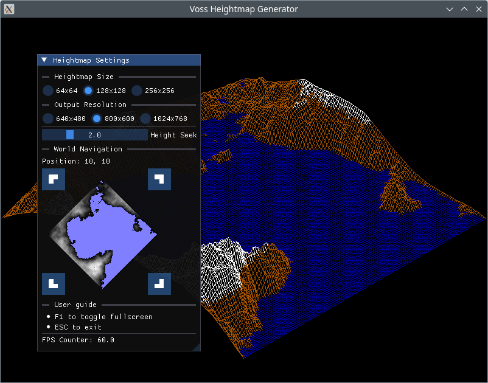
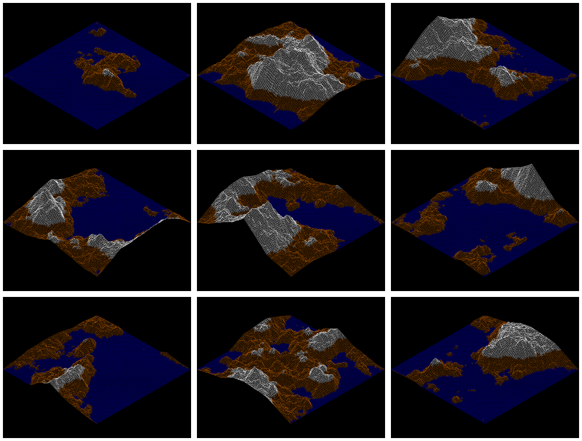

## Introduction

Procedural heightmap generator and renderer with isometric view
based on the program `LANDVOSS` for DOS-like systems from the early 1990's.
As for now there is only a console utility that generates PNG images.

The heightmap algorithm is based on the paper by Voss and Clarke, 1978 and
utilizes pink noise.





## Contents

* `VossImage` - console utility that produces images with a specified seed and coordinates.
* `VossLandscape` - interactive version with GUI.

### Usage options

```
VossImage [options] <output file name>
```

* `-h`,`--help` - Show help message.
* `-r`,`--resolution WxH` - Output image resolution. Default is 1024x768. The algorithm is ported from DOS and it is best suited for VGA/SVGA resolutions such as 640x480, 800x600 and 1024x768.
* `-w`,`--worldpos X,Y` - Heightmap X and Y coords in the global procedural world. Default coordinates are 10,10.

## Environment Setup

### Debian-based Systems

The following instructions apply to:

* Ubuntu 20.04, 18.04, 16.04
* Debian 9 and higher

```
sudo apt-get install -y \
    build-essential \
    cmake \
    xorg-dev \
    libgl1-mesa-dev \
    libfreetype6-dev
```

### RedHat-based Systems

The following instructions apply to:

* Fedora 22 and higher

```
sudo dnf install -y \
    gcc gcc-c++ make \
    cmake \
    mesa-libGL-devel \
    libXrandr-devel \
    libXinerama-devel \
    libXcursor-devel \
    libXi-devel \
    freetype-devel
```

* CentOS 7 and higher

```
sudo yum install -y \
    gcc gcc-c++ make \
    cmake \
    mesa-libGL-devel \
    libXrandr-devel \
    libXinerama-devel \
    libXcursor-devel \
    libXi-devel \
    freetype-devel
```

## Cloning Repository

Cloning the repository requires passing the `--recursive` flag to load dependencies

```
git clone --recursive https://github.com/Postrediori/VossLandscape.git
cd VossLandscape
```

## Building Project on Linux

The program is built with the commands below. CMake requires the directory 
with the main project's `CMakeLists.txt` file as an argument. Then the CMake 
creates the build files for the GNU make which build an executable.

```
mkdir build && cd build
cmake .. -DCMAKE_BUILD_TYPE=Release
make
make install
```

## Building Project on macOS

Generate build files and build sources on macOS with the following commands:

```
mkdir build && cd build
cmake .. -DCMAKE_OSX_ARCHITECTURES=x86_64 -DCMAKE_BUILD_TYPE=Release
make
make install
```

## Running Project

After the successful build the binary `VossLandscape` will end up in `bundle/VossLandscape/` directory.

```
cd bundle/VossLandscape
./VossLandscape
```

## Links

* Richard F. Voss and John Clarke. ["1/f noise" in music: Music from 1/f noise](https://asa.scitation.org/doi/abs/10.1121/1.381721). The Journal of the Acoustical Society of America 63, 258 (1978).
* Richard F.Voss. [Random fractals: Self-affinity in noise, music, mountains, and clouds](https://doi.org/10.1016/0167-2789(89)90220-0). Physica D: Nonlinear Phenomena 38, 1-3 (1989).
